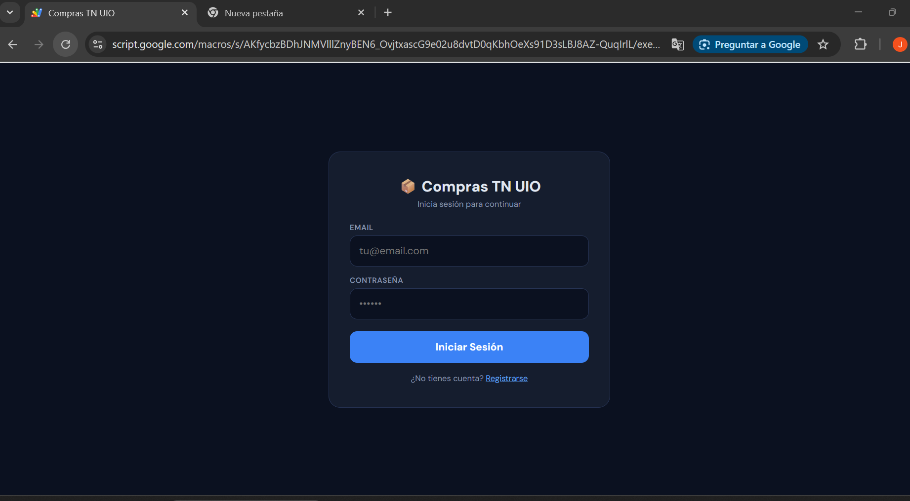
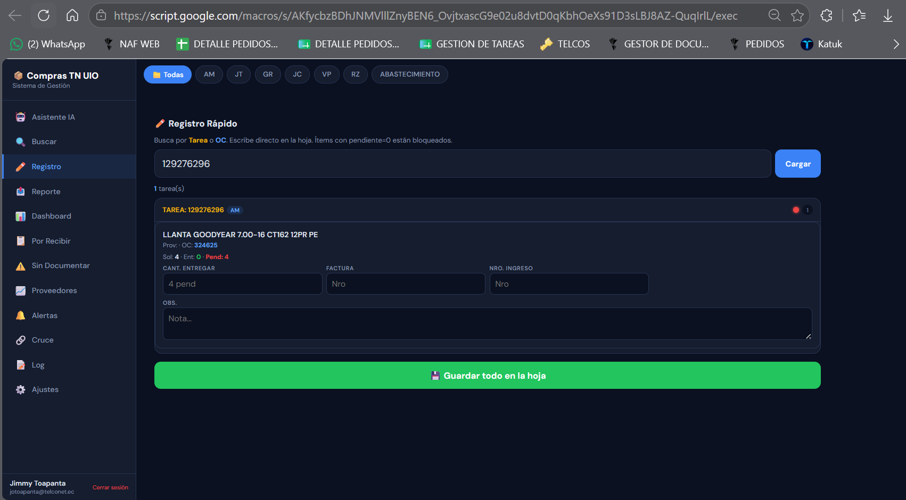
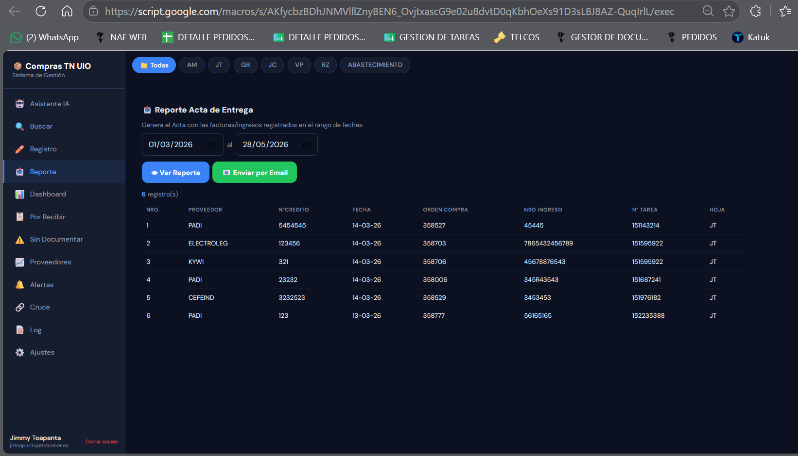

# Compras TN UIO

Plataforma web para seguimiento operativo de compras construida sobre Google Apps Script y Google Sheets.

El proyecto nació para resolver un problema bastante práctico: la información de una compra puede terminar repartida entre tareas, órdenes, entregas, facturas, ingresos, proveedores y observaciones que no siempre siguen exactamente la misma estructura. Revisar todo eso a mano funciona mientras el volumen es pequeño; después empieza a consumir demasiado tiempo y es fácil pasar por alto un pendiente.

La aplicación toma esas hojas como fuente operativa y agrega una capa web para consultar, registrar y resumir información sin tener que recorrer celda por celda.

## Qué resuelve

Desde una sola interfaz se puede:

- revisar el estado general de las tareas de compra;
- buscar por tarea, OC, proveedor, producto, código, factura o ingreso;
- identificar entregas pendientes;
- detectar ítems entregados que todavía no están documentados;
- registrar facturas, ingresos, cantidades entregadas y observaciones;
- consultar carga y pendientes por proveedor;
- clasificar tareas por antigüedad;
- mantener un log de las modificaciones realizadas desde la aplicación;
- generar reportes de actas de entrega;
- enviar reportes por correo;
- consultar información operativa mediante un asistente de IA sin enviar indiscriminadamente toda la hoja al modelo.

No reemplaza Google Sheets. La hoja sigue siendo la fuente de datos y la aplicación se encarga de leerla, normalizarla y escribir en las filas correspondientes cuando se registra información.

## Acceso a la plataforma

La aplicación dispone de una pantalla de acceso para separar las sesiones de cada usuario.



## Dashboard principal

El dashboard concentra los indicadores que normalmente obligarían a revisar varias hojas: tareas en proceso, entregas pendientes, registros sin ingreso, documentación faltante y antigüedad.


## Cómo está armado

La versión publicada actualmente mantiene una estructura sencilla. La mayor parte del backend y de la interfaz se conserva en `Remoto.js`, mientras que `appsscript.json` mantiene la configuración del proyecto Apps Script.

```text
compras-tn-uio-ai-platform/
│
├── Remoto.js
├── appsscript.json
├── .clasp.example.json
├── .gitignore
├── README.md
│
└── docs/
    └── screenshots/
        ├── 01-login.png
        ├── 02-dashboard.png
        ├── 03-task-search.png
        ├── 04-alerts.png
        ├── 05-batch-register.png
        ├── 06-report-export.png
        └── 07-ai-assistant.png
```

No se publica `.clasp.json` porque pertenece a la configuración local de cada instalación. En su lugar se deja una plantilla sin identificadores reales.

A futuro tiene sentido separar `Remoto.js` por responsabilidades, pero el repositorio debe documentar primero la estructura que realmente se está ejecutando.

## Flujo de datos

```text
Usuario
   │
   ▼
Web App de Apps Script
   │
   ├── autenticación y sesión
   ├── búsquedas y dashboard
   ├── registro de datos
   ├── reportes
   └── asistente de IA
   │
   ▼
Google Apps Script
   │
   ├── SpreadsheetApp
   ├── PropertiesService
   ├── DriveApp
   ├── MailApp
   └── UrlFetchApp
   │
   ▼
Google Sheets + servicios externos configurados
```

La zona horaria del proyecto es `America/Guayaquil` y el runtime utilizado es V8.

## Lectura de hojas operativas

Una de las partes más importantes del proyecto es el parser.

Las hojas reales no siempre llegan con una estructura idéntica. Actualmente se reconocen, entre otras, dos formas de trabajo:

```text
TAREA
  └── detalle / ítems
      └── DELIMITADOR
```

y:

```text
PROVEEDOR
  └── OC
      └── descripción / ítems
          └── DELIMITADOR
```

El parser busca los encabezados que necesita, normaliza nombres con saltos de línea y conserva la fila física de cada ítem. Esto último es importante porque cuando se registra una factura, un ingreso o una cantidad entregada, la aplicación debe volver a la fila original y no a una copia intermedia.

También se contemplan compras canceladas, anuladas o suspendidas para evitar que sigan apareciendo como pendientes operativos.

## Pendientes y estado de una tarea

Cuando existe una columna de pendiente, se utiliza su valor. Si no está informada, el sistema puede calcularlo a partir de:

```text
Pendiente = Cantidad solicitada - Cantidad entregada
```

Las tareas se agrupan además por antigüedad para facilitar la priorización:

| Estado | Antigüedad |
|---|---:|
| Normal | 0 a 10 días |
| Atención | 11 a 20 días |
| Urgente | 21 a 30 días |
| Crítico | Más de 30 días |

La primera fecha conocida de cada tarea se conserva en `TAREA_TRACKING`.

## Búsqueda de tareas

La búsqueda no se limita al número de tarea. Puede encontrar coincidencias dentro de los campos de los ítems y permite trabajar con datos como:

- tarea;
- orden de compra;
- proveedor;
- código;
- descripción;
- factura;
- número de ingreso;
- texto libre.

Esto evita depender de que el usuario recuerde exactamente en qué hoja se registró algo.


## Alertas operativas

Las alertas combinan la antigüedad con condiciones operativas como entregas pendientes o documentación incompleta.

La intención no es reemplazar el criterio de quien gestiona la compra. Sirven para reducir el barrido manual y poner arriba los casos que merecen revisión primero.


## Registro por lote

Desde la Web App se pueden registrar datos que normalmente terminarían editándose directamente en la hoja:

- factura;
- número de ingreso;
- cantidad entregada;
- observaciones.

El registro se hace sobre la fila original del ítem y cada modificación deja una entrada en `LOG_REGISTRO`.

Cuando un campo admite más de un dato, por ejemplo varias facturas asociadas al mismo registro, el sistema conserva lo anterior en lugar de sobrescribirlo sin contexto.



## Trazabilidad

`LOG_REGISTRO` funciona como bitácora de las operaciones hechas desde la aplicación.

Entre los datos registrados están:

```text
TIMESTAMP
USUARIO
HOJA
TAREA
DETALLE
TIPO
VALOR
CAMPO
FILA
```

Esto permite reconstruir qué se cambió, sobre qué tarea y desde qué fila.

No pretende sustituir un sistema formal de auditoría; es una trazabilidad operativa para saber qué ocurrió dentro de esta herramienta.

## Proveedores

La aplicación también consolida información por proveedor para tener una lectura rápida de:

- tareas asociadas;
- órdenes de compra;
- cantidad de ítems;
- pendientes de entrega;
- registros sin ingreso;
- facturas pendientes cuando la hoja utiliza ese campo.

Este resumen resulta útil para seguimiento, sobre todo cuando varios pendientes terminan concentrados en un mismo proveedor.

## Reportes y exportación

A partir de los registros disponibles se pueden generar actas en formato Excel y enviarlas por correo.

El proceso contempla:

1. filtrar la información requerida;
2. evitar duplicados evidentes;
3. construir el archivo temporal;
4. preparar el correo;
5. adjuntar el reporte;
6. eliminar el archivo temporal cuando deja de ser necesario.

El destinatario, la copia y el responsable se obtienen de la configuración del proyecto y no deben quedar escritos directamente en el repositorio público.



## Asistente de IA

El asistente está pensado como una forma adicional de consultar la operación, no como fuente primaria de datos.

Antes de llamar al proveedor configurado, el código intenta identificar términos relevantes —por ejemplo tareas, códigos, OCs, productos o proveedores— y construir un contexto limitado con las coincidencias encontradas.

El objetivo es evitar enviar una hoja completa cuando la pregunta se puede responder con unas pocas filas relacionadas.

Actualmente el proyecto contempla proveedores como Groq y OpenRouter mediante claves almacenadas en `PropertiesService`.

Ejemplos de consultas útiles:

```text
¿Qué tareas siguen pendientes?
¿La OC indicada ya tiene ingreso?
¿Qué proveedor concentra más entregas pendientes?
¿Cuál fue el último precio registrado para este código?
¿Qué facturas faltan por documentar?
```

La respuesta del modelo debe tratarse como una ayuda para consulta. Cuando el dato sea crítico, la referencia final sigue siendo la información registrada en las hojas.


## Autenticación y sesiones

La aplicación mantiene usuarios y sesiones en hojas auxiliares:

```text
USUARIOS
SESIONES
```

El flujo contempla:

- registro de usuario;
- hash de contraseña;
- cuenta activa o desactivada;
- token de sesión;
- identificación básica del dispositivo;
- cierre de sesión;
- actualización del último acceso.

Esta autenticación es suficiente para el alcance actual del proyecto, pero si la aplicación crece o se expone fuera del entorno previsto, este módulo debería reforzarse.

## Configuración

Los valores que cambian entre instalaciones se guardan mediante `PropertiesService`.

Entre las propiedades utilizadas están:

```text
EMAIL_DESTINO
EMAIL_CC
RESPONSABLE
DIAS_ALERTA
FILA_MINIMA
GROQ_API_KEY
OPENROUTER_API_KEY
IA_PROVIDER
```

Las API keys, correos internos, IDs de hojas y demás valores reales no deben formar parte del repositorio público.

## Desarrollo local con clasp

Para trabajar desde una PC se puede utilizar `clasp`.

Instalación:

```bash
npm install -g @google/clasp
```

Inicio de sesión:

```bash
clasp login
```

Después de crear el `.clasp.json` local con el `scriptId` correspondiente:

```bash
clasp pull
```

para traer cambios desde Apps Script, y:

```bash
clasp push
```

para enviar los cambios locales.

Antes de subir JavaScript conviene comprobar al menos que el archivo siga siendo sintácticamente válido:

```bash
node --check Remoto.js
```

## Configuración de `.clasp.json`

El repositorio incluye `.clasp.example.json` como referencia.

Copia ese archivo:

```cmd
copy .clasp.example.json .clasp.json
```

y reemplaza únicamente:

```text
TU_SCRIPT_ID
```

por el identificador del proyecto Apps Script correspondiente.

`.clasp.json` está excluido por `.gitignore`, por lo que la configuración local no debería entrar en commits nuevos.

## Publicación como Web App

La implementación se realiza desde Google Apps Script.

Después de un cambio importante conviene comprobar:

- inicio de sesión;
- carga del dashboard;
- búsqueda;
- alertas;
- registro de un dato de prueba;
- escritura en la fila correcta;
- generación de reporte;
- envío de correo cuando aplique;
- consulta del asistente si está configurado.

El manifiesto actual ejecuta la Web App con el usuario que accede. Antes de usar esta aplicación con información real, los permisos deben revisarse de acuerdo con el entorno donde se despliegue.

## Seguridad y publicación

Este repositorio está pensado como una versión sanitizada del proyecto.

No deberían publicarse:

- claves de API;
- contraseñas;
- tokens o cookies;
- IDs reales de hojas corporativas;
- `.clasp.json`;
- correos internos;
- datos reales de proveedores;
- órdenes de compra o facturas reales;
- capturas que permitan identificar información interna;
- archivos de respaldo del historial;
- notas personales utilizadas para ejecutar comandos de Git.

El `.gitignore` ayuda, pero no sustituye la revisión antes del commit. Si un archivo ya fue agregado a Git en el pasado, añadirlo después al `.gitignore` no deja de rastrearlo automáticamente.

## Capturas incluidas

Las capturas públicas incluidas en el repositorio son:

```text
docs/screenshots/01-login.png
docs/screenshots/02-dashboard.png
docs/screenshots/03-task-search.png
docs/screenshots/04-alerts.png
docs/screenshots/05-batch-register.png
docs/screenshots/06-report-export.png
docs/screenshots/07-ai-assistant.png
```

Se mantienen dentro del README para que una persona pueda entender el proyecto sin necesidad de tener acceso a la hoja real.

## Criterio de mantenimiento

Hay algunas reglas simples que intento mantener en este proyecto:

- los comentarios explican decisiones o reglas de negocio, no cada línea obvia;
- la información sensible se configura fuera del código;
- un commit debe representar un cambio concreto;
- antes de confirmar se revisa exactamente qué archivos están preparados;
- los cambios de lógica se prueban contra una copia controlada de las hojas;
- la documentación describe lo que existe hoy.

## Autor

**Jimmy Omar Toapanta Guayanay**  
Ingeniero en Informática — Quito, Ecuador
