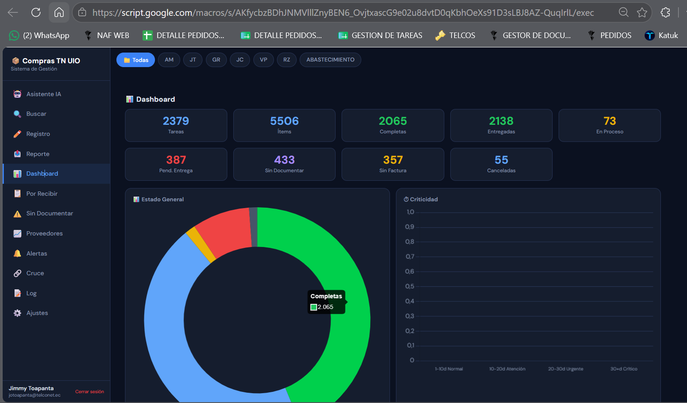
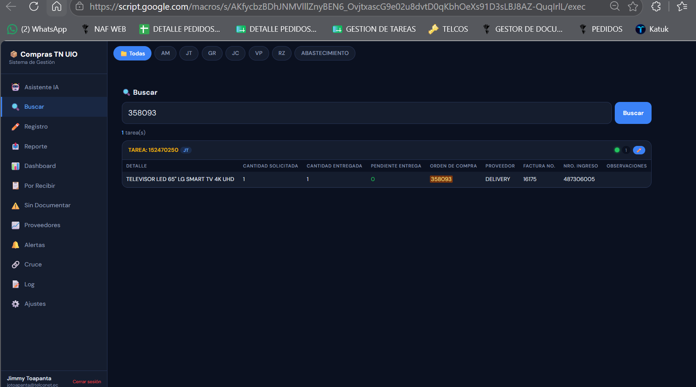
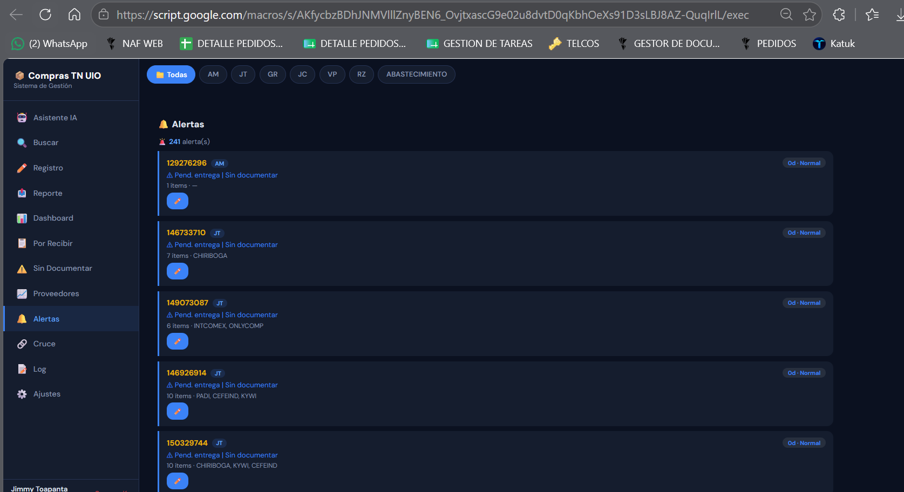
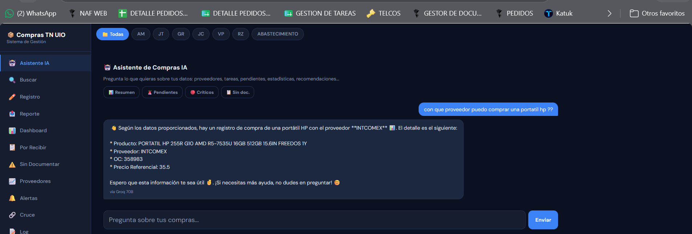

# Compras TN UIO — Plataforma Web con IA


## Descripción general

**Compras TN UIO** es una plataforma web interna desarrollada en **Google Apps Script** sobre **Google Sheets**, diseñada para centralizar y automatizar el seguimiento operativo de compras, entregas, facturas, ingresos de inventario, proveedores, órdenes de compra y reportes administrativos.

El sistema convierte hojas de cálculo operativas en una aplicación web con autenticación, dashboard en tiempo real, alertas por criticidad, registro rápido de información, trazabilidad de cambios, generación de reportes en Excel, envío automático por correo y un asistente con inteligencia artificial para realizar consultas en lenguaje natural sobre la información de compras.

Este proyecto fue desarrollado para resolver una necesidad real dentro de un entorno corporativo, reduciendo trabajo manual repetitivo y mejorando la trazabilidad de los procesos de compras.

---

## Problema identificado

Antes de esta solución, el seguimiento de compras dependía de procesos manuales distribuidos en hojas de cálculo, revisión visual de pendientes, validación manual de facturas, búsqueda de órdenes de compra, control operativo de tareas y generación manual de reportes.

Esto provocaba problemas como:

- Dificultad para consultar rápidamente el estado de una tarea.
- Seguimiento manual de entregas pendientes.
- Falta de visibilidad sobre facturas e ingresos pendientes.
- Reportes administrativos elaborados manualmente.
- Riesgo de errores por actualización manual de datos.
- Dependencia de múltiples hojas con estructuras diferentes.
- Poca trazabilidad sobre quién actualizaba información y cuándo.
- Demora para responder consultas sobre proveedores, órdenes de compra o productos.

---

## Solución desarrollada

La solución consiste en una **Web App serverless** construida con Google Apps Script, conectada directamente a Google Sheets como fuente de datos operativa.

La plataforma permite:

- Consultar tareas, proveedores, órdenes de compra y productos.
- Visualizar indicadores operativos en un dashboard.
- Detectar compras pendientes, canceladas o completadas.
- Registrar facturas, números de ingreso, entregas y observaciones.
- Generar logs automáticos de cada operación.
- Clasificar tareas por nivel de criticidad.
- Generar reportes de actas de entrega en Excel.
- Enviar reportes automáticamente por correo.
- Consultar datos mediante un asistente IA conectado a Groq/OpenRouter.

---

## Características principales

### 1. Aplicación Web con Google Apps Script

La plataforma está desplegada como una aplicación web utilizando `HtmlService`.

Incluye:

- Interfaz web responsive.
- Backend en Google Apps Script.
- Integración directa con Google Sheets.
- Ejecución serverless sin infraestructura externa.
- Despliegue como Web App.
- Compatibilidad con navegadores modernos.

---

### 2. Autenticación de usuarios

El sistema incluye un módulo de autenticación propio.

Funciones principales:

- Registro de usuarios.
- Inicio de sesión.
- Validación de usuario activo.
- Hash de contraseña con SHA-256.
- Generación de token de sesión.
- Control de sesión por dispositivo.
- Cierre de sesión.
- Registro de sesiones en hoja dedicada.

Hojas utilizadas:

```txt
USUARIOS
SESIONES
```

Campos principales de usuarios:

```txt
EMAIL
NOMBRE
PASSWORD_HASH
FECHA_REGISTRO
ACTIVO
```

Campos principales de sesiones:

```txt
TOKEN
EMAIL
FINGERPRINT
FECHA_CREACION
ULTIMO_ACCESO
```

---

### 3. Dashboard operativo

El dashboard resume el estado general del proceso de compras.

Indicadores incluidos:

- Total de tareas.
- Total de ítems.
- Ítems pendientes de entrega.
- Ítems sin número de ingreso.
- Ítems sin factura.
- Tareas completadas.
- Tareas en proceso.
- Tareas críticas.
- Tareas canceladas o suspendidas.
- Ítems cancelados.
- Tareas entregadas.
- Distribución por hoja de origen.
- Clasificación por criticidad.

El objetivo del dashboard es entregar visibilidad rápida del estado operativo sin necesidad de revisar manualmente cada hoja.

---

### 4. Parser automático de hojas

El sistema incluye un parser dinámico para leer hojas con estructuras operativas distintas.

Puede detectar:

- Bloques por tarea.
- Bloques por proveedor.
- Bloques por orden de compra.
- Encabezados variables.
- Delimitadores.
- Hojas tipo JT/RZ.
- Hojas tipo abastecimiento.
- Columnas con saltos de línea.
- Datos incompletos.
- Registros suspendidos o cancelados.

Tipos de estructura soportados:

```txt
TAREA → DETALLE → ÍTEMS → DELIMITADOR
PROVEEDOR → OC → DESCRIPCIÓN → ÍTEMS → DELIMITADOR
```

Esto permite que la aplicación funcione sobre hojas reales de operación, incluso cuando no todas tienen exactamente el mismo formato.

---

### 5. Detección de compras canceladas o suspendidas

El sistema identifica automáticamente registros cancelados, anulados o suspendidos mediante análisis de observaciones.

Ejemplos de patrones detectados:

```txt
compra cancelada
se cancela
cancelado
anulada
se anula
oc cancelada
oc anulada
compra suspendida
stock en bodega
no se requiere
no aplica
rechazado
devuelto
```

Estos registros se excluyen de ciertos cálculos operativos para evitar que contaminen los indicadores de pendientes.

---

### 6. Cálculo de pendientes

El sistema calcula automáticamente la cantidad pendiente de entrega.

La lógica considera:

```txt
PENDIENTE ENTREGA
CANTIDAD SOLICITADA
CANTIDAD ENTREGADA
```

Si la columna de pendiente está vacía o incompleta, el sistema calcula:

```txt
Pendiente = Cantidad Solicitada - Cantidad Entregada
```

Esto permite mantener control operativo aunque algunos datos no hayan sido actualizados manualmente.

---

### 7. Clasificación de criticidad

Cada tarea se clasifica según su antigüedad y estado.

Niveles utilizados:

| Nivel | Rango aproximado |
|---|---|
| Normal | 0 a 10 días |
| Atención | 11 a 20 días |
| Urgente | 21 a 30 días |
| Crítico | Más de 30 días |

La primera fecha en la que una tarea aparece se registra en la hoja:

```txt
TAREA_TRACKING
```

Esto permite calcular los días transcurridos y priorizar tareas antiguas.

---

### 8. Búsqueda avanzada

La plataforma permite buscar información por diferentes criterios:

- Número de tarea.
- Orden de compra.
- Proveedor.
- Producto.
- Descripción.
- Código.
- Factura.
- Número de ingreso.
- Palabra clave.
- Hoja específica.
- Todas las hojas disponibles.

La búsqueda analiza tanto campos principales como contenido interno de cada ítem.

---

### 9. Gestión de proveedores

El sistema genera un resumen por proveedor con indicadores como:

- Total de ítems.
- Pendientes de entrega.
- Ítems sin ingreso.
- Ítems sin factura.
- Número de órdenes de compra.
- Número de tareas asociadas.

Esto facilita analizar qué proveedores concentran mayor carga operativa o mayor cantidad de pendientes.

---

### 10. Alertas operativas

La plataforma genera alertas para tareas que requieren atención.

Criterios considerados:

- Pendientes de entrega.
- Falta de documentación.
- Falta de número de ingreso.
- Antigüedad de la tarea.
- Estado de criticidad.
- Proveedor asociado.
- Hoja de origen.

Las alertas se ordenan por criticidad:

```txt
Crítico → Urgente → Atención → Normal
```

---

### 11. Módulo “Por Recibir”

Este módulo lista únicamente tareas con ítems pendientes de entrega.

Filtra automáticamente:

- Tareas canceladas.
- Tareas suspendidas.
- Ítems anulados.
- Ítems sin pendiente.

El objetivo es entregar una vista limpia de lo que realmente falta recibir.

---

### 12. Módulo “Sin Documentar”

Identifica ítems que ya fueron entregados, pero aún tienen documentación incompleta.

Detecta casos como:

- Entregado sin factura.
- Entregado sin número de ingreso.
- Entregado con factura pendiente.
- Entregado con ingreso pendiente.

Este módulo ayuda a cerrar brechas entre compras, bodega, inventario y contabilidad.

---

### 13. Registro rápido de información

La plataforma permite actualizar información directamente desde la Web App.

Campos que se pueden registrar:

- Número de factura.
- Número de ingreso.
- Cantidad entregada.
- Observaciones.

El registro puede hacerse por lote, evitando editar manualmente celda por celda en Google Sheets.

---

### 14. Escritura directa en Google Sheets

El sistema actualiza las hojas originales manteniendo trazabilidad.

Características:

- Busca automáticamente los encabezados correctos.
- Actualiza la fila real del ítem.
- Agrega valores nuevos sin borrar registros anteriores.
- Usa separador `/` para conservar historial en campos acumulativos.
- Actualiza cantidad entregada.
- Recalcula pendiente de entrega.
- Registra cada operación en el log.

Ejemplo de actualización acumulativa:

```txt
Factura existente: 001-001-123
Nueva factura: 001-001-456

Resultado:
001-001-123 / 001-001-456
```

---

### 15. Log de actividad

Cada modificación realizada desde la plataforma se registra automáticamente.

Hoja utilizada:

```txt
LOG_REGISTRO
```

Campos principales:

```txt
TIMESTAMP
USUARIO
HOJA
TAREA
DETALLE
TIPO
VALOR
CAMPO
FILA
```

Tipos de operación:

```txt
FACTURA
INGRESO
CANT_ENT
OBS
```

Esto permite auditar qué se registró, cuándo, en qué hoja, sobre qué tarea y en qué fila.

---

### 16. Cruce de tareas

La plataforma cruza la información de pedidos con la hoja de gestión para validar si una tarea existe o ya fue gestionada.

Permite identificar:

- Tareas presentes en pedidos.
- Tareas presentes en gestión.
- Tareas pendientes de cruce.
- Tareas sin registro relacionado.
- Estado semaforizado.
- Cantidad de ítems pendientes.
- Cantidad de ítems sin ingreso.

---

### 17. Reporte de acta de entrega

El sistema genera reportes de actas de entrega a partir del log de facturas e ingresos.

El reporte incluye:

- Número.
- Proveedor.
- Número de crédito/factura.
- Fecha de factura.
- Orden de compra.
- Número de ingreso.
- Número de tarea.
- Hoja de origen.

El sistema también deduplica facturas para evitar repetir registros cuando una misma factura aparece asociada a varios ítems.

---

### 18. Generación de Excel

El sistema crea automáticamente un archivo Excel con formato de acta.

Características:

- Archivo `.xlsx`.
- Encabezado institucional.
- Tabla formateada.
- Bordes.
- Autoajuste de columnas.
- Datos filtrados por rango de fechas.
- Archivo temporal eliminado después de la generación.

---

### 19. Envío automático por correo

La plataforma puede enviar el reporte generado a los destinatarios configurados.

Incluye:

- Asunto automático.
- Cuerpo HTML.
- Tabla embebida.
- Archivo Excel adjunto.
- Copia opcional.
- Responsable configurable.
- Limpieza del archivo temporal en Drive.

---

### 20. Triggers automáticos

El sistema permite configurar un trigger diario para envío automático de reportes.

Ejemplo:

```txt
Todos los días a las 07:00
Zona horaria: America/Guayaquil
```

Función asociada:

```txt
enviarResumenAuto()
```

---

### 21. Asistente IA integrado

La plataforma incluye un asistente con inteligencia artificial para consultar información operativa en lenguaje natural.

Proveedores soportados:

```txt
Groq
OpenRouter
```

El asistente puede responder preguntas sobre:

- Estado de pedidos.
- Tareas pendientes.
- Proveedores.
- Órdenes de compra.
- Facturas.
- Ingresos.
- Productos.
- Códigos.
- Precios referenciales.
- Historial de compras.
- Departamentos solicitantes.

---

### 22. IA con contexto reducido

El asistente no envía toda la base de datos al modelo.

Primero:

1. Analiza la pregunta.
2. Extrae palabras clave.
3. Detecta códigos, tareas u órdenes de compra.
4. Busca coincidencias relevantes.
5. Construye un contexto reducido.
6. Envía solo los datos necesarios al modelo.

Esto mejora:

- Velocidad.
- Precisión.
- Costo de tokens.
- Control sobre alucinaciones.
- Seguridad de datos.

---

### 23. Búsqueda inteligente para IA

El motor de IA usa varias fuentes internas:

```txt
Pedidos operativos
Precios Enero
General
Historial de compras
Datos de proveedores
Órdenes de compra
Facturas
Ingresos
```

También incluye normalización de texto, eliminación de palabras genéricas y búsqueda por códigos.

Ejemplos de consultas soportadas:

```txt
¿Qué tareas están pendientes?
¿Qué proveedor tiene más pendientes?
¿La OC 123456 ya tiene ingreso?
¿Qué facturas faltan por registrar?
¿Cuál fue el último precio de este producto?
¿Qué se compró para cierto departamento?
¿Hay productos pendientes de entrega?
```

---

## Arquitectura del sistema

```txt
Usuario
  ↓
Web App HTML/CSS/JavaScript
  ↓
Google Apps Script Backend
  ↓
Google Sheets / PropertiesService / DriveApp / MailApp
  ↓
Groq API / OpenRouter API
```

---

## Flujo general

```txt
1. El usuario ingresa a la Web App.
2. El sistema valida sesión.
3. El usuario consulta dashboard, tareas, proveedores o alertas.
4. Apps Script lee datos desde Google Sheets.
5. El parser normaliza bloques e ítems.
6. El backend calcula KPIs, pendientes y criticidad.
7. El frontend muestra resultados.
8. Si el usuario registra datos, el sistema actualiza la hoja original.
9. Cada cambio queda guardado en LOG_REGISTRO.
10. Los reportes pueden generarse y enviarse por correo.
```

---

## Flujo del asistente IA

```txt
1. Usuario escribe una pregunta.
2. El sistema detecta si es conversación simple o consulta operativa.
3. Se extraen palabras clave, códigos y números relevantes.
4. Se buscan coincidencias en pedidos, precios e historial.
5. Se construye un contexto reducido.
6. Se consulta Groq u OpenRouter.
7. El asistente responde en lenguaje natural.
```

---

## Stack tecnológico

| Área | Tecnología |
|---|---|
| Backend | Google Apps Script |
| Frontend | HTML, CSS, JavaScript |
| Base operativa | Google Sheets |
| Automatización | Apps Script Triggers |
| Reportes | SpreadsheetApp, DriveApp, MailApp |
| IA | Groq API, OpenRouter API |
| Seguridad | SHA-256, tokens, PropertiesService |
| Integraciones | REST APIs |
| Control de versiones | Git, GitHub, clasp |
| Zona horaria | America/Guayaquil |

---

## Servicios de Google utilizados

```txt
SpreadsheetApp
HtmlService
PropertiesService
Utilities
Session
ScriptApp
DriveApp
MailApp
UrlFetchApp
```

---

## Estructura sugerida del repositorio

```txt
compras-tn-uio-ai-platform/
│
├── README.md
├── CHANGELOG.md
├── LICENSE
├── .gitignore
├── .clasp.example.json
├── appsscript.example.json
│
├── src/
│   ├── 00_Config.example.gs
│   ├── 01_WebApp.gs
│   ├── 02_Auth.gs
│   ├── 03_DataParser.gs
│   ├── 04_Dashboard.gs
│   ├── 05_Register.gs
│   ├── 06_Reports.gs
│   ├── 07_AI_Assistant.gs
│   ├── 08_Triggers.gs
│   └── Index.html
│
├── docs/
│   ├── architecture.md
│   ├── deployment.md
│   ├── user-guide.md
│   ├── data-model.md
│   └── screenshots/
│       ├── 01-login.png
│       ├── 02-dashboard.png
│       ├── 03-task-search.png
│       ├── 04-alerts.png
│       ├── 05-batch-register.png
│       ├── 06-report-export.png
│       └── 07-ai-assistant.png
│
└── samples/
    ├── script-properties.example.json
    └── demo-data-structure.xlsx
```

---

## Módulos principales

| Módulo | Responsabilidad |
|---|---|
| `Config.gs` | Configuración general y lectura de propiedades |
| `WebApp.gs` | Entrada principal de la aplicación web |
| `Auth.gs` | Registro, login, sesiones y validación |
| `DataParser.gs` | Lectura, normalización y análisis de hojas |
| `Dashboard.gs` | KPIs, métricas, alertas y resúmenes |
| `Register.gs` | Registro batch de facturas, ingresos y entregas |
| `Reports.gs` | Generación de reportes Excel y envío por email |
| `AI_Assistant.gs` | Consultas con IA sobre datos operativos |
| `Triggers.gs` | Automatizaciones programadas |
| `Index.html` | Interfaz gráfica de usuario |

---

## Modelo de datos

### Hojas principales

```txt
USUARIOS
SESIONES
LOG_REGISTRO
TAREA_TRACKING
Hoja de pedidos
Hoja de gestión
Precios Enero
General
```

---

### Estructura de usuarios

```txt
EMAIL
NOMBRE
PASSWORD_HASH
FECHA_REGISTRO
ACTIVO
```

---

### Estructura de sesiones

```txt
TOKEN
EMAIL
FINGERPRINT
FECHA_CREACION
ULTIMO_ACCESO
```

---

### Estructura del log

```txt
TIMESTAMP
USUARIO
HOJA
TAREA
DETALLE
TIPO
VALOR
CAMPO
FILA
```

---

### Estructura de tracking

```txt
TAREA
PRIMERA_VEZ
```

---

## Variables de configuración

Las variables sensibles se deben configurar desde **Apps Script > Project Settings > Script Properties**.

```txt
SPREADSHEET_ID
SHEET_GESTION_ID
SHEET_GESTION_NAME
LOG_SHEET_NAME
FILA_MINIMA
EMAIL_DESTINO
EMAIL_CC
RESPONSABLE
DIAS_ALERTA
GROQ_API_KEY
OPENROUTER_API_KEY
IA_PROVIDER
```

Ejemplo de configuración:

```json
{
  "SPREADSHEET_ID": "ID_DE_LA_HOJA_PRINCIPAL",
  "SHEET_GESTION_ID": "ID_DE_LA_HOJA_DE_GESTION",
  "SHEET_GESTION_NAME": "Hoja 1",
  "LOG_SHEET_NAME": "LOG_REGISTRO",
  "FILA_MINIMA": "500",
  "EMAIL_DESTINO": "correo@empresa.com",
  "EMAIL_CC": "copia@empresa.com",
  "RESPONSABLE": "Sistemas Compras",
  "DIAS_ALERTA": "15",
  "IA_PROVIDER": "groq",
  "GROQ_API_KEY": "TU_API_KEY",
  "OPENROUTER_API_KEY": "TU_API_KEY"
}
```

> Importante: no subir valores reales de configuración al repositorio.

---

## Instalación y uso con clasp

### 1. Instalar clasp

```bash
npm install @google/clasp -g
```

### 2. Iniciar sesión

```bash
clasp login
```

### 3. Clonar proyecto existente

```bash
clasp clone SCRIPT_ID
```

### 4. Descargar cambios desde Apps Script

```bash
clasp pull
```

### 5. Subir cambios hacia Apps Script

```bash
clasp push
```

### 6. Crear una versión

```bash
clasp version "v1.0.0"
```

### 7. Desplegar

```bash
clasp deploy
```

---

## Despliegue como Web App

Pasos generales:

```txt
1. Abrir el proyecto en Google Apps Script.
2. Ir a Implementar.
3. Seleccionar Nueva implementación.
4. Elegir tipo: Aplicación web.
5. Configurar acceso según la política interna.
6. Autorizar permisos.
7. Copiar URL de implementación.
8. Probar login, dashboard, búsqueda, reportes e IA.
```

---

## Permisos requeridos

La aplicación necesita permisos para:

- Leer hojas de cálculo.
- Escribir en hojas de cálculo.
- Crear hojas auxiliares.
- Leer y escribir propiedades del script.
- Crear archivos temporales en Drive.
- Enviar correos electrónicos.
- Ejecutar triggers.
- Consumir APIs externas mediante `UrlFetchApp`.

---

## Seguridad

Medidas aplicadas:

- Hash de contraseñas con SHA-256.
- Token de sesión por usuario.
- Validación de cuenta activa.
- Control básico por fingerprint de dispositivo.
- API keys almacenadas en `PropertiesService`.
- Logs de cambios operativos.
- Configuración separada del código.
- Recomendación de uso de datos anonimizados en repositorio público.

---

## Buenas prácticas aplicadas

- Separación lógica de responsabilidades.
- Normalización de datos.
- Reutilización de helpers.
- Manejo de configuración por propiedades.
- Trazabilidad mediante logs.
- Clasificación de criticidad.
- Automatización de reportes.
- Procesamiento dinámico de hojas.
- Reducción de contexto enviado a IA.
- Uso de triggers para tareas programadas.

---

## Consideraciones de privacidad

Este repositorio debe publicarse usando datos ficticios o anonimizados.

No subir:

```txt
IDs reales de hojas corporativas
API keys
Correos internos reales
Datos reales de proveedores
Órdenes de compra reales
Facturas reales
Números de ingreso reales
Capturas con información sensible
URLs internas privadas
```

---


### Dashboard principal



### Búsqueda de tareas



### Alertas operativas



### Asistente IA


```

---

## Ejemplos de uso

### Consulta de tareas

```txt
Buscar tarea: 123456
```

Resultado esperado:

```txt
Tarea encontrada
Hoja de origen
Proveedor
Orden de compra
Detalle de ítems
Cantidad solicitada
Cantidad entregada
Pendiente
Factura
Número de ingreso
Estado
```

---

### Consulta por proveedor

```txt
Proveedor: PROVEEDOR DEMO S.A.
```

Resultado esperado:

```txt
Total de ítems
Tareas asociadas
Órdenes de compra
Pendientes de entrega
Pendientes de ingreso
Pendientes de factura
```

---

### Registro rápido

Campos soportados:

```txt
Factura
Ingreso
Cantidad entregada
Observación
```

Cada registro genera una entrada automática en `LOG_REGISTRO`.

---

### Reporte por fechas

```txt
Desde: 2025-01-01
Hasta: 2025-01-31
```

Resultado:

```txt
Archivo Excel generado
Tabla HTML en correo
Envío automático al destinatario configurado
```

---

### Preguntas al asistente IA

Ejemplos:

```txt
¿Qué tareas están críticas?
¿Qué proveedor tiene más pendientes?
¿La OC 123456 ya tiene ingreso?
¿Qué productos faltan por entregar?
¿Qué facturas están pendientes?
¿Cuál fue el último precio registrado para este producto?
¿Qué compras se hicieron para cierto departamento?
```

---

## Impacto operativo

La plataforma permitió:

- Centralizar información dispersa en varias hojas.
- Reducir búsqueda manual de tareas y órdenes de compra.
- Automatizar seguimiento de pendientes.
- Mejorar visibilidad sobre compras en proceso.
- Detectar brechas de documentación.
- Generar reportes administrativos con menor esfuerzo manual.
- Registrar cambios con trazabilidad.
- Consultar información mediante lenguaje natural.
- Reducir dependencia de revisión manual en hojas de cálculo.

---

## Resultados técnicos destacados

- Desarrollo de una Web App funcional sobre Google Apps Script.
- Integración con Google Sheets como fuente de datos operativa.
- Implementación de autenticación y sesiones.
- Parser dinámico para estructuras de hojas no uniformes.
- Dashboard con KPIs operativos.
- Registro batch con escritura directa en celdas reales.
- Generación y envío de reportes Excel.
- Integración con APIs externas de IA.
- Trazabilidad mediante logs.
- Automatización mediante triggers programados.

---

## Retos técnicos resueltos

### 1. Hojas con estructuras variables

El sistema no depende de una única estructura rígida. Detecta encabezados, delimitadores y bloques dinámicamente.

### 2. Información operativa incompleta

Cuando el pendiente no está registrado, el sistema lo calcula con base en cantidad solicitada y cantidad entregada.

### 3. Datos cancelados o suspendidos

Se implementó detección automática para excluir registros que no deben considerarse como pendientes reales.

### 4. Reportes administrativos

El sistema genera archivos Excel con formato y los envía automáticamente por correo.

### 5. Consultas con IA

Se diseñó un flujo para enviar al modelo solo datos relevantes, reduciendo consumo y mejorando precisión.

---

## Roadmap

Mejoras futuras consideradas:

- Migrar parte de la lógica a una API externa dedicada.
- Implementar roles de usuario más detallados.
- Agregar historial visual de cambios.
- Crear panel administrativo para usuarios.
- Agregar filtros avanzados por departamento.
- Mejorar el motor de búsqueda semántica.
- Implementar pruebas automatizadas con clasp.
- Crear ambiente demo con datos ficticios.
- Agregar exportación PDF.
- Agregar integración directa con WhatsApp Business API.

---

## Lecciones aprendidas

Este proyecto permitió aplicar conocimientos de desarrollo de software en un problema operativo real:

- Análisis de procesos.
- Automatización de flujos manuales.
- Diseño de una aplicación web interna.
- Integración con servicios de Google Workspace.
- Manejo de datos en hojas de cálculo.
- Diseño de reportes automáticos.
- Consumo de APIs externas.
- Integración de inteligencia artificial.
- Trazabilidad y control de cambios.
- Documentación técnica para mantenimiento.

---

## Enfoque profesional del proyecto

Este repositorio documenta una solución desarrollada en un entorno real de trabajo, donde se aplicaron principios de ingeniería de software para mejorar procesos internos.

El valor principal del proyecto no está solo en el código, sino en haber identificado una necesidad operativa, diseñado una solución funcional, automatizado tareas repetitivas y creado una herramienta útil para usuarios no técnicos.

---

## Autor

**Jimmy Omar Toapanta Guayananay**  
Ingeniero en Informática  
Quito, Ecuador  

GitHub: [github.com/eslay07](https://github.com/eslay07)

---

## Licencia

Este proyecto se documenta con fines profesionales y demostrativos.

Para uso público, se recomienda publicar únicamente una versión sanitizada, sin datos corporativos, credenciales, IDs reales, correos internos ni información sensible.
